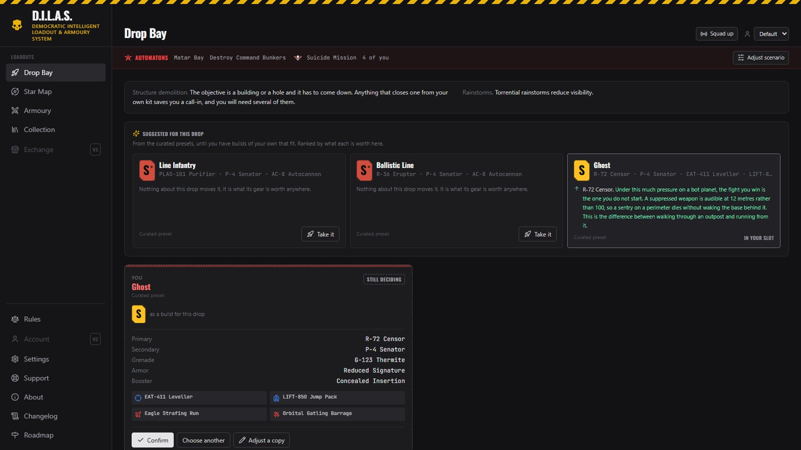
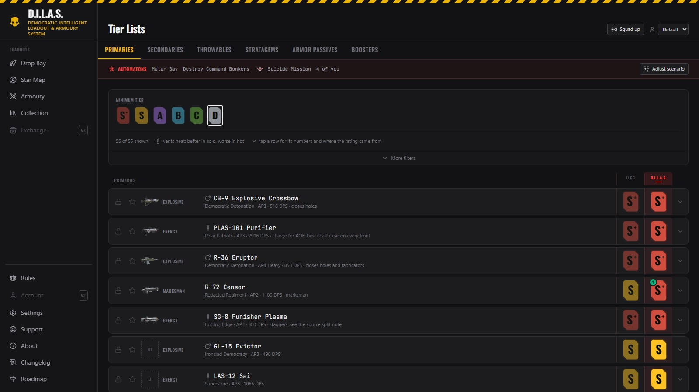
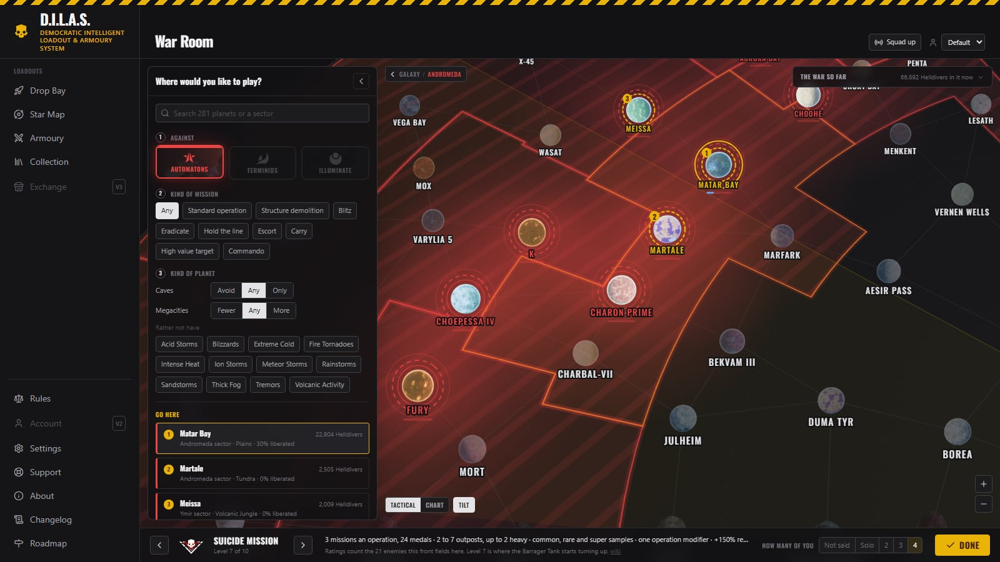
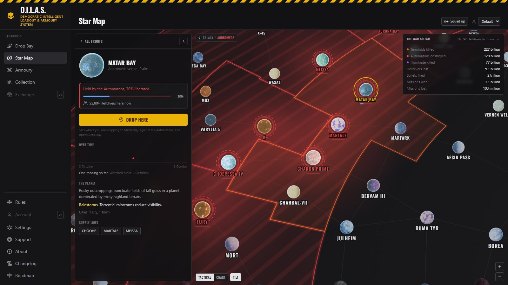
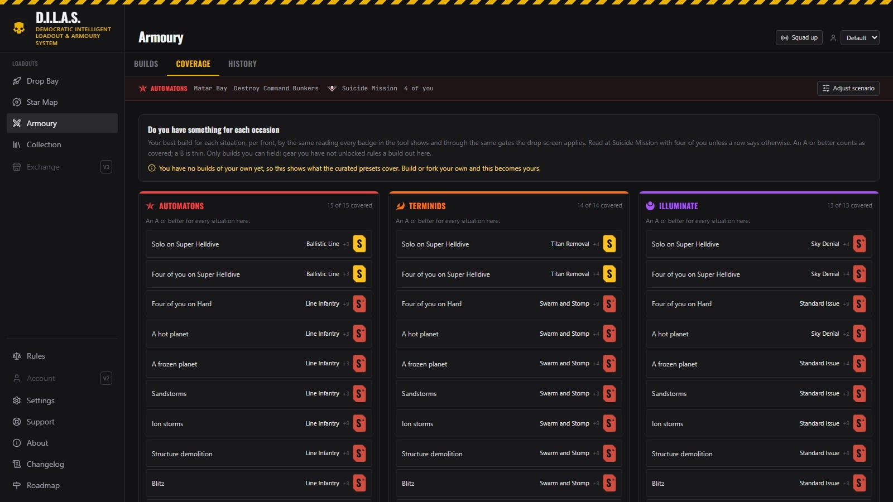
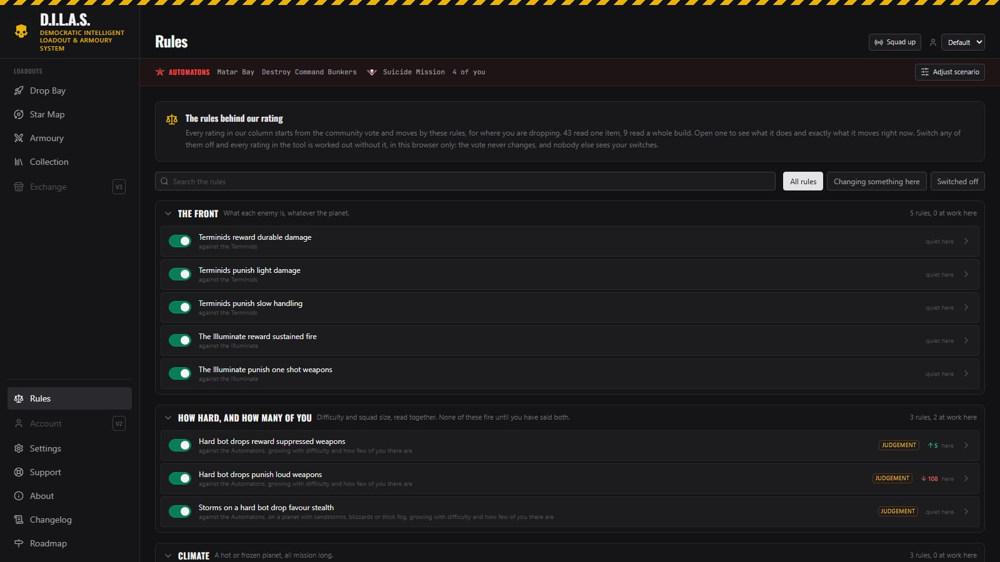

<h1 align="center">D.I.L.A.S.</h1>

<p align="center">
  <b>Democratic Intelligent Loadout &amp; Armoury System</b><br>
  A loadout tool for <b>Helldivers 2</b> that rates every weapon and stratagem for where you are actually dropping,<br>
  and gets your squad into the same drop with the same plan.
</p>

<p align="center">
  <a href="https://dilas.me"></a>
  
  
  
</p>

<p align="center">
  <a href="#what-it-does">What it does</a> ·
  <a href="#use-it">Use it</a> ·
  <a href="#what-it-keeps-and-what-it-sends">What it keeps and what it sends</a> ·
  <a href="#building-from-source">Building from source</a>
</p>

> *"Citizen! A loadout chosen in haste is a loadout chosen against Democracy. Read the planet. Read the rating.
> Confirm with pride. Your Super Destroyer is watching, and so is the Ministry."*
> A Democracy Officer, probably



## What it does

### Rates everything for where you are dropping

Every weapon, stratagem, armour passive and booster carries **two ratings side by side**: the community vote from
u.gg, and ours for the drop you are about to make. Ours reads the front, the planet and its hazards, the mission,
the difficulty and how many of you there are, and **every point of difference comes with a sentence saying why**.
A suppressed rifle climbs on a hard bot drop because a sentry dies without waking the base behind it; a heat weapon
does better on a frozen planet; a reinforcement booster cannot even be brought on a Commando mission, where nobody
respawns until you find the pods.

A community tier is an average over every planet, every difficulty and every squad size. D.I.L.A.S. is for the one
you are actually playing.



### Drop Bay: the screen before you dive

The tool opens on it. **Three of your own builds are suggested for this drop, ranked, each saying why it fits.**
Pick one, adjust it without leaving the screen, and confirm. Confirming counts: it goes in your drop history, and
only confirmed builds reach your squad.

**Squad up with a six character code.** Whoever types it in joins, up to four, no account needed. Everybody's
confirmed loadout lands in their slot on every screen, the host's scenario becomes everybody's, and a squad read
says what the four of you are missing: no anti-tank on a hard bug drop, nothing that closes a hole from your own kit
on a demolition mission.

### The war room

Where you set up the drop, laid out like the game's Galactic War screen. **Click the planet where you clicked it in
the game a minute ago, and its front, biome and hazards fill themselves in.** The map is coloured with the live war,
fronts ringed and named, the Major Order over the top. Not sure where to go? Say what you are after (against whom,
what kind of mission, no caves, fewer megacities) and the planner marks the three busiest fronts that fit.

Difficulty steps the way the game steps it, with what each level brings beside it: the missions in an operation, the
medals, the outposts, the samples, the operation modifiers.



### The Star Map

The same map for reading the war rather than setting up a drop. Every front grouped by who you would fight there,
busiest first. Click a planet for who holds it and how far along, how many Helldivers are there, what its hazards
do, its cities and supply lines, and how it has moved over time. **Drop here** sets it as your drop in one click.

Nobody publishes the war's history, so D.I.L.A.S. keeps its own: one reading an hour, thirty days back.



### The Armoury

Your builds, saved and named with their stratagems, which the game does not keep. The list you pick from **is the
tier list, already ranked for where you are going.** Coverage answers the question you actually have: do I have
something for solo on Super Helldive, for a frozen planet, for a Commando mission, on every front? History shows
where your evenings went, and which builds are gathering dust.



### Rules you can read, and switch off

Every rule behind our rating is on one page: what it does, where it applies, whether it is our judgement or sourced,
and **exactly which items it moves where you are dropping right now**. Switch one off and every rating in the tool is
worked out without it, in your browser only.



### And also

- **Collection**: what you own, as the game sells it. Warbonds and the items inside them are separate purchases, so
  they are two separate switches. A second profile for a second player.
- **Share a build in a link.** The build is written into the link itself, so it works with no account and no server.
- **Thirteen themes**, ten of them skins with their own atmosphere: tracer fire over Malevelon Creek, rain for the
  ODSTs, the Ministry of Truth on paper.
- **For a change**: once you have a few drops logged, Drop Bay suggests a build you have not taken lately, and good
  gear you have never brought against this front.
- **Backup and restore** of everything you own and made, as one file.

## Use it

Open **[dilas.me](https://dilas.me)**. Nothing to install and no account. Everything you own and build lives in
your browser; **Settings → Export** saves it as a file, and **Import** brings it back.

Used it at an older address? Your collection lives with the address, so Export there and Import here, once.

## What it keeps and what it sends

D.I.L.A.S. is built so you can check exactly what it does. In short:

| Where | What |
|---|---|
| Your browser | Your collection, profiles, builds, favourites and drop history, plus how this browser shows things (theme, map look, switched off rules). Clearing your browser data clears them, which is what Export is for. |
| The tool's server, in a party | Only while you are in one: the name you give, the loadout you confirm and the host's scenario, passed to the others in that party and nobody else. The party is deleted twelve hours after it goes quiet. Your seat is held by a random token in your browser; the server keeps only its hash. Opening and joining parties is rate limited per network address, counted per hour. |
| The tool's server, the war | Every five minutes it reads the live war from [api.helldivers2.dev](https://api.helldivers2.dev) and keeps the latest copy, plus one an hour for thirty days. Your browser asks the tool's own server, never anyone else. |
| Anywhere else | Nothing. No analytics, no trackers, no third party scripts or fonts: the security policy refuses anything from another address. Accounts are built but switched off. |

The code for this lives in [`worker/party.ts`](worker/party.ts), [`worker/war.ts`](worker/war.ts),
[`worker/limit.ts`](worker/limit.ts) and [`public/_headers`](public/_headers).

## Building from source

Needs Node 20+. The server half runs on Cloudflare Workers, and [Wrangler](https://developers.cloudflare.com/workers/wrangler/)
comes with `npm install`.

```sh
npm install
npm run dev              # the app on its own, at localhost:5173 (no party, no live war)
npm run build            # validates the data, then builds dist/
npx wrangler dev         # the app with its server, at localhost:8788 (needs a .dev.vars)
npm run test:worker      # the server's tests, inside the Workers runtime against a real local database
```

Checks to run before a commit. Each exits non zero on a failure:

```sh
npm run validate         # every reference resolves: ids, rules, missions, warbonds
npm run rules            # every item rule still discriminates, and switching one off moves only its items
npm run builds           # the same for the rules that read a whole build, against 300 random builds
npm run drop             # Drop Bay: the gates, the squad, suggestions, history, share links, coverage
npm run map              # the galaxy map's arithmetic, the war snapshot, the planner, the difficulty table
npm run typecheck        # the server
```

Art is optional. With `src/assets` empty, every item reads by its name instead of its picture and nothing breaks.
`npm run images` fills it from a local `Image Library/` folder.

| Path | What |
|---|---|
| `src/` | The app (React 18, Vite 6, Tailwind 3) |
| `src/lib/` | Everything that is not a picture: the scoring engine, the scenario, the galaxy map's maths, Drop Bay's logic |
| `src/data/` | Items, ratings, rules, missions, planets, enemies and difficulty, as JSON |
| `worker/` | The server: a Cloudflare Worker with D1, and a Durable Object per party |
| `scripts/` | The data fetches and the checks |
| [`CLAUDE.md`](CLAUDE.md), [`dilas-roadmap.md`](dilas-roadmap.md) | How the tool works and why, and what comes next |

## Where the numbers come from

- **Community ratings**: [u.gg](https://u.gg), read by hand, each list with its patch stamp.
- **Weapon stats for 105 weapons**: the game's own files, through the decoded snapshot
  [filediver](https://github.com/xypwn/filediver) publishes. The tool never opens a game install.
- **Reload times, stratagems, enemy armour, the difficulty table and the weapons the game files do not cover**:
  [helldivers.wiki.gg](https://helldivers.wiki.gg), CC BY-NC-SA 4.0.
- **Planets, biomes and hazards**: [helldivers-2/json](https://github.com/helldivers-2/json), MIT. Map positions,
  supply lines and the live war: [api.helldivers2.dev](https://api.helldivers2.dev).
- **Fonts**: Oswald and JetBrains Mono, served from the tool itself.

Our rating, the role tags and every rule's judgement are ours, and the tool says so wherever they appear.

## Feedback and support

Found a rating that is wrong for a situation, or a bug? [Open an issue](https://github.com/Stigsmith/D.I.L.A.S./issues).

If D.I.L.A.S. saves your squad a wipe, you can [buy a Helldiver a cup of Liber-tea on Ko-fi](https://ko-fi.com/stigsmith).

## Licence

No licence has been chosen yet, so for now the code is all rights reserved; you are welcome to read it and run it
for yourself. Data from helldivers.wiki.gg remains CC BY-NC-SA 4.0.

D.I.L.A.S. is an unofficial, fan-made community tool. Not affiliated with, endorsed by, or sponsored by Arrowhead
Game Studios or Sony Interactive Entertainment. HELLDIVERS is a trademark of Sony Interactive Entertainment LLC.
